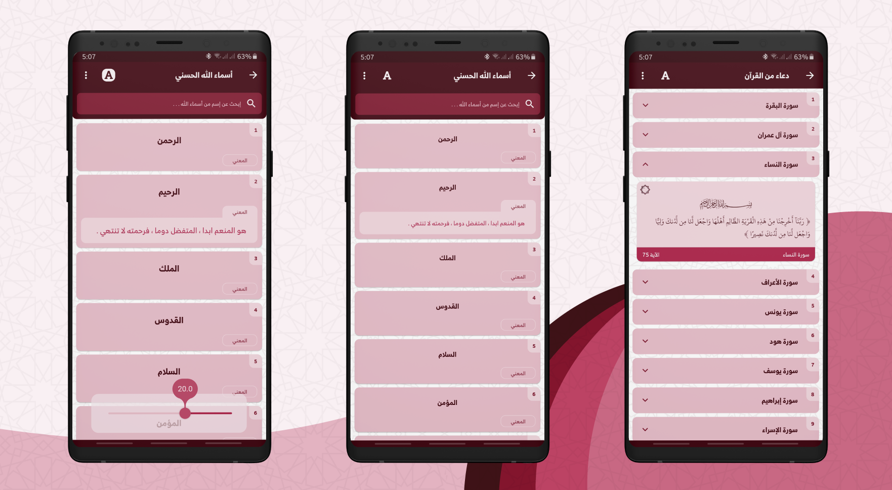

#  Azkark

It’s an Azkar application that contains azkar’ taken from hisn al muslim book.


## Installation steps

Open CMD where you want to clone the project & run the following commands

```
git clone https://github.com/youssef7ussien/Azkark-Flutter.git
cd Azkark-Flutter
flutter pub get
flutter run
```
## Gallery

|  Screenshots    |
|:----:|
|  |
|  |
|  |
|  |


## Author

#### Youssef Hussien

>> You can also follow my GitHub Profile to stay updated about my latest projects: [GitHub Follow](https://github.com/youssef7ussien)

>> If you liked the repo then kindly support it by giving it a star ⭐!

Copyright (c) 2020